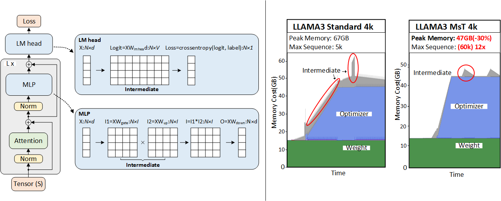

# MINI-SEQUENCE TRANSFORMER (MST)

<div align="center">
  
  <h2>Highly Efficient and Accurate LLM Training with Extremely Long Sequences</h2>
</div>



This repository provides an overview of all resources for the paper ["MINI-SEQUENCE TRANSFORMER: Optimizing Intermediate Memory for Long Sequences Training"](https://www.arxiv.org/abs/2407.15892).

- [Overview](#overview)
- [Artifacts](#artifacts)
- [Features](#features)
- [Benchmar](#benchmark)
- [Finetune](#finetune)
- [News](#news)
- [Contributing](#citation)
- [Citation](#citation)
- [License](#license)

### Overview

MINI-SEQUENCE TRANSFORMER (MST) is a simple and effective method for highly efficient and accurate LLM training with extremely long sequences. Our research demonstrates that the Llama3-8B model can be trained with context lengths up to 60k tokens on a single NVIDIA A100 GPU with 80GB memory, representing a 12x increase in maximum sequence length compared to standard implementations.

We believe that our work opens new avenues for long-sequence training of LLMs, and reduces the hardware obstacles for researchers and developers aiming to create LLMs with long context.

### Artifacts

- **Paper**: https://www.arxiv.org/abs/2407.15892
- **HuggingFace with MST** [Code](https://github.com/wdlctc/transformers).
- **Model Finetune Guidence** [LLAMA3](https://github.com/wdlctc/mini-s/blob/main/doc/llama3.md), [Qwen2](https://github.com/wdlctc/mini-s/blob/main/doc/qwen.md), [Memba](https://github.com/wdlctc/mini-s/blob/main/doc/falcon-mamba.md), [Mistral](https://github.com/wdlctc/mini-s/blob/main/doc/mistral.md), [Gemma2](https://github.com/wdlctc/mini-s/blob/main/doc/gemma.md)
- **Distributed Finetune Guidence** [DP](https://github.com/wdlctc/mini-s/blob/main/doc/distributed.md#1-data-parallel-dp), [FSDP](https://github.com/wdlctc/mini-s/blob/main/doc/distributed.md#2-fully-sharded-data-parallel-fsdp)

### Features

- 🚀 Enables training Llama3-8B with 60k token sequences on a single A100 GPU (4x longer than activation recomputation alone)
- 🏎️ Maintains the same training throughput as standard implementations
- 🛠️ Fully general and implementation-agnostic, supporting most parameter-efficient training methods
- 🔌 Easy to integrate into existing training frameworks with minimal code changes

### Benchmark
Install the mini-sequence warpper `pip install -e .` and run:


```python
import torch
import os
import time

from transformers import AutoTokenizer, AutoModelForCausalLM
from torch.optim import AdamW
from minis.mini_sequence import minisequence

name_or_path = "meta-llama/Meta-Llama-3-8B"
model = AutoModelForCausalLM.from_pretrained(name_or_path,
        _attn_implementation="flash_attention_2",
        torch_dtype=torch.bfloat16,
        trust_remote_code=True,
    ).cuda()
model.train()
model = minisequence(model)

optimizer = AdamW(model.parameters(), lr=5e-5)

SEQ_LEN = 8192
input_ids = torch.randint(low=3, high=10000, size=(1, SEQ_LEN), device="cuda")

torch.cuda.synchronize()
t1 = time.perf_counter()
for _ in range(3):
    loss = model(input_ids=input_ids, labels=input_ids).loss
    loss.backward()
    optimizer.step()
    optimizer.zero_grad()
torch.cuda.synchronize()
t2 = time.perf_counter()
print("Pretrains throughput {} token/s".format((SEQ_LEN/((t2 - t1)/3))))


print(
    "Peak allocated bytes on {:4f}GB".format(
        torch.cuda.memory_stats(0)["allocated_bytes.all.peak"] / 2**30
    )
)
```
You can try running with/without mini-sequence warpper using [benchmark with MST](https://github.com/wdlctc/mini-s/tree/main/scripts/benchmark_minis.ipynb) and [benchmark without MST](https://github.com/wdlctc/mini-s/tree/main/scripts/benchmark.ipynb).

### Finetune/Pretrain

Follow these steps to set up your environment:

1. Deploy the mini-sequence version of Hugging Face Transformers:
   ```bash
   pip install -U git+https://github.com/wdlctc/transformers
   ```

2. Clone the LongLoRA repository and install dependencies:
   ```bash
   git clone https://github.com/dvlab-research/LongLoRA
   cd LongLoRA
   pip install -r requirements.txt
   pip install flash-attn --no-build-isolation
   ```

3. Before running the fine-tuning script, set an environment variable to clean memory fragments:
   ```bash
   export PYTORCH_CUDA_ALLOC_CONF="max_split_size_mb:64"
   ```

4. Now, run the fine-tuning script:
   ```bash
   python fine-tune.py  \
    --model_name_or_path meta-llama/Meta-Llama-3.1-8B \
    --bf16 True \
    --output_dir path_to_saving_checkpoints \
    --cache_dir path_to_cache \
    --model_max_length 32768 \
    --use_flash_attn True \
    --low_rank_training False \
    --num_train_epochs 1 \
    --per_device_train_batch_size 1 \
    --per_device_eval_batch_size 1 \
    --gradient_accumulation_steps 8 \
    --evaluation_strategy "no" \
    --save_strategy "steps" \
    --save_steps 1000 \
    --save_total_limit 2 \
    --learning_rate 2e-5 \
    --weight_decay 0.0 \
    --warmup_steps 20 \
    --lr_scheduler_type "constant_with_warmup" \
    --logging_steps 1 \
    --low_rank_training False \
    --max_steps 1000
   ```
This script demonstrates how mini-sequence allows us to fine-tune the Llama 3 model with a context length of 32,768 tokens - a feat that would be challenging or impossible with standard training methods on single A100 GPU.

### News

- [8/11/2024] We've added MST support for QWEN, Gemma2, and Mistral models. You can find the implementation on our [transformers fork](https://github.com/wdlctc/transformers).
- [7/26/2024] Our work can be directly deployed for LLAMA 3.1, take benchmark_replace_llama3_1.py as an example to see how it works.


### Contributing

We welcome contributions to the MST project. If you're interested in collaborating on MST research or have questions about our work, please open an issue or submit a pull request.

### Citation

If you use minis in your publication, please cite it by using the following BibTeX entry:

```BibTeX
@misc{luo2024mst,
      title={MINI-SEQUENCE TRANSFORMER: Optimizing Intermediate Memory for Long Sequences Training}, 
      author={Luo, Cheng and Zhao, Jiawei and Chen, Zhuoming and Chen, Beidi and Anandkumar, Anima},
      year={2024},
      eprint={2407.15892},
      archivePrefix={arXiv},
      primaryClass={cs.DC}
}
```

### License

MST refers to [huggingface/transformers](https://github.com/huggingface/transformers), Copyright 2018- The Hugging Face team, licensed under [Apache License](http://www.apache.org/licenses/LICENSE-2.0).

This project is licensed under the MIT License.

For any inquiries, please contact wdlctc@gmail.com.
