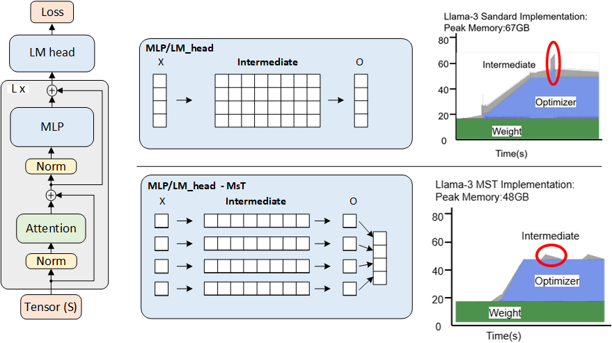

# MINI-SEQUENCE TRANSFORMER (MST)

## Overview

MINI-SEQUENCE TRANSFORMER (MST) is a simple and effective method for highly efficient and accurate LLM training with extremely long sequences. Our research demonstrates that the Llama3-8B model can be trained with context lengths up to 60k tokens on a single NVIDIA A100 GPU with 80GB memory, representing a 12x increase in maximum sequence length compared to standard implementations.

We believe that our work opens new avenues for long-sequence training of LLMs, and reduces the hardware obstacles for researchers and developers aiming to create LLMs with long context.



## Key Features

- Enables training Llama3-8B with 60k token sequences on a single A100 GPU (4x longer than activation recomputation alone)
- Maintains the same training throughput as standard implementations
- Fully general and implementation-agnostic, supporting most parameter-efficient training methods
- Easy to integrate into existing training frameworks with minimal code changes

## NEWS

- [7/26/2024] Our work can be directly deployed for LLAMA 3.1, take benchmark_replace_llama3_1.py as an example to see how it works.
- [8/11/2024] We've added MST support for QWEN, Gemma2, and Mistral models. You can find the implementation on our [transformers fork](https://github.com/wdlctc/transformers).

## Installation

To install and run the mini-s model, follow these steps:

1. Clone the repository:

   ```
   git clone https://github.com/wdlctc/mini-s.git
   cd mini-s
   ```

2. Install the required dependencies:

   ```
   pip install -r requirements.txt
   ```

3. Install the `flash-attn` package:

   ```
   pip install flash-attn --no-build-isolation
   ```

Note: The `--no-build-isolation` flag is used to avoid potential build conflicts.

## Usage

To run the benchmark script and evaluate the performance of the mini-s model, use the following one-click-run command:
   ```
   python benchmark_replace.py
   ```
This file contains the modifications made to the original model to create the mini-s version.

## No Code Change Run

To run the original code without any modifications (sfttrainer for example), follow these steps:

1. Clone the transformer-mini-s repository:

   ```
   git clone https://github.com/wdlctc/transformers.git
   cd transformers
   ```

2. Install the transformer with mini-s:

   ```
   pip install -e .
   ```

this will execute the original benchmark script using mini-s enable.

## Example of mini-s Work with Performance/SFT Training
For an example of mini-s model work with performance and SFT (Soft Finetuning) training, refer to the repository https://github.com/wdlctc/peft_minis.

## How It Works

MST partitions input sequences and iteratively processes mini-sequences to reduce intermediate memory usage. When integrated with activation recomputation, this allows for significant memory savings in both forward and backward passes.

## Benefits

MST opens up new possibilities for training LLMs on long sequences using limited hardware resources:

- Enables efficient training on much longer sequences
- Improves LLM capabilities across tasks that benefit from extended context, like long document summarization and multi-turn dialogue
- Requires no changes to model architecture, making it broadly applicable to a wide range of existing and future transformer models

## Experimental Results

We evaluated MST on popular models like Llama3-8B and Llama2-7B. In our experiments, we observed:

- No degradation in convergence or throughput even with 12x longer sequences compared to standard implementations
- Llama3-8B can be trained with context lengths up to 60k tokens on a single NVIDIA A100 GPU
- Llama2-7B can be trained with context lengths up to 84k tokens on a single NVIDIA A100 GPU

## Contributing

We welcome contributions to the MST project. If you're interested in collaborating on MST research or have questions about our work, please open an issue or submit a pull request.

## Citing Mini-s

If you use minis in your publication, please cite it by using the following BibTeX entry.


```BibTeX
@misc{luo2024mst,
      title={MINI-SEQUENCE TRANSFORMER: Optimizing Intermediate Memory for Long Sequences Training}, 
      author={Luo, Cheng and Zhao, Jiawei and Chen, Zhuoming and Chen, Beidi and Anandkumar, Anima},
      year={2024},
      eprint={2407.15892},
      archivePrefix={arXiv},
      primaryClass={cs.DC}
}
```

## License

MsT refers [huggingface/transformers](https://github.com/huggingface/transformers), Copyright 2018- The Hugging Face team, licensed under [Apache License](http://www.apache.org/licenses/LICENSE-2.0).

This project is licensed under, MIT License.

## Contact

For any inquiries, please contact wdlctc@gmail.com.
